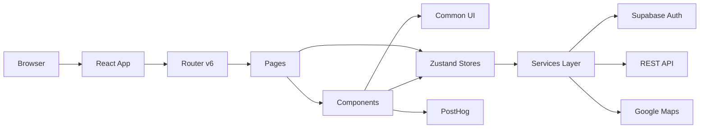
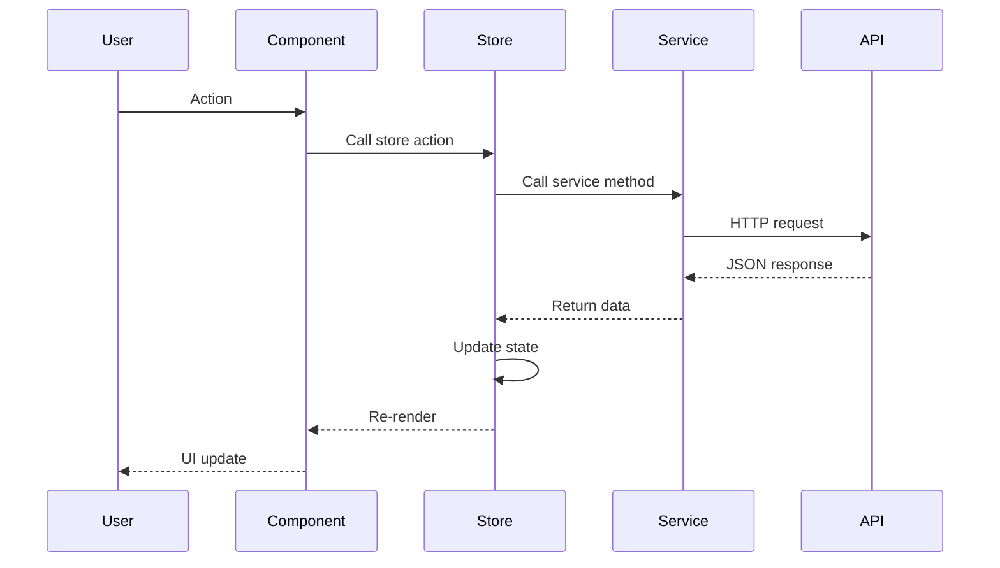

# Architecture

The 360Ghar frontend is a React 18.2 single-page application bundled with Vite 7.3. The browser loads `index.html`, which mounts `src/main.jsx`. From there a `BrowserRouter` renders `src/App.jsx`, which declares all routes (static pages, dynamic property/project/blog routes, tool routes, and programmatic SEO landing routes). Pages live in `src/pages/`, compose reusable components from `src/components/` and `src/common/`, talk to the backend through the service layer in `src/services/`, and read/write shared state via Zustand stores in `src/store/`. Authentication is handled by the Supabase Auth SDK; the access token is injected into every authenticated Axios request. Public endpoints (property search, blog) skip auth.

## High-Level Architecture



## Data Flow



## Layers

### Routing (`src/App.jsx`)
React Router v6 with a flat route table. Static routes cover core pages, account, properties, projects, blog, tools, and SEO guides. Dynamic routes use `:id` / `:title` / `:slug` params. Programmatic SEO routes match `/:citySlug/:intent/:type` and optional `/:bhk`, `/budget/:budget`, `/amenity/:amenity` facets. A `ScrollToTop` component resets scroll on navigation, and a catch-all renders `NotFound`.

### Pages (`src/pages/`)
Route-level components grouped by domain: `core/`, `account/`, `properties/`, `projects/`, `blogs/`, `tools/`, `landing/`. Each page wires data fetching, sets SEO meta via `src/common/SEO.jsx`, and composes section components. Pages stay thin; logic lives in stores and services.

### Components (`src/components/`)
Feature-domain components: `ui/` (banners, counters, testimonials, CTAs), `property/` (cards, details, filters), `property-filters/` (advanced filter UI), `account/` (dashboard tabs, private route), `blog/` (cards, detail sections), `layout/` (about, gallery, FAQ, map), `project/` (portfolio, details), `forms/` (login, register, listing), `contact/`, and `vastu/` (floor plan upload, score card, report).

### Common (`src/common/`)
Shared primitives used across pages: layout (`Header`, `Footer`, `MobileMenu`, `OffCanvas`, `Breadcrumb`), footer subcomponents, forms and inputs (`SearchBox`, `GooglePlacesInput`, `CustomRangeSlider`, `NewsletterForm`, `ImageUpload`, `FaqAccordion`), sidebars, blog elements, SEO wrapper, branding (`Logo`, `LogoWhite`), and UI helpers (`Button`, `SectionHeading`, `PageTitle`, `Pagination`, `StarRating`, `LazyImage`).

### Services (`src/services/`)
API layer built on Axios. `http.js` is the instance factory with HTTPS enforcement, 3-retry on 5xx GETs, 30s timeout, and 401 → one (deduped) Supabase session refresh + single retry (no logout/redirect; re-auth is left to route guards). `api.js` is the authenticated instance. Domain services cover `authService`, `userService`, `propertyService`, `propertyAPIService` (public search), `mediaService`, `swipeService`, `visitService`, `blogService`, `pageService`, `utilityService`, `agentService`, `deletionService`, and `vastuService`. All use a shared `extractError` helper that normalizes FastAPI/Pydantic v2 error shapes.

### State (`src/store/`)
Zustand stores: `authStore` (user, token, login/register/logout), `propertyStore` (the largest; 31 filter fields, search, swipes, CRUD), `userStore`, `locationStore` (geolocation with 24h persistence, Gurugram fallback), `visitStore`, `agentStore`, `adminStore` (mostly stubs). Persisted slices use Zustand's persist middleware.

### Context (`src/contextApi/`)
`BlogDataContext` carries blog posts/categories/current post between blog components. Zustand is the primary state library; context is reserved for legacy UI state that needs to flow through the React tree.

## Styling System

SCSS using the 7-1 architecture pattern in `public/assets/sass/`:

```
sass/
├── abstracts/   variables, mixins, functions, utilities
├── base/        typography, margin, padding, reset
├── components/  button, form, card
├── layout/      header, footer
├── partials/    home, home-two, home-three, othersPage, rtl
└── main.scss    entry point
```

Brand tokens live in `src/styles/_theme.scss` as CSS custom properties: `--main-color` (#ff6b00), `--main-color-dark` (#cc5500), `--main-color-light` (#ff8c3a), `--cta-color` (#0369A1), plus semantic, text, border, and background tokens. Components must reference these variables, never hardcode hex values. Typography uses Cinzel for headings and Josefin Sans for body.

## Build Pipeline

`npm run build` runs a multi-stage pipeline before Vite bundles the SPA:

1. Entity ingestion of Gurgaon area data
2. Sitemap generation (`scripts/generate-sitemaps.mjs`) for static, landing, locality, and property URLs
3. RSS feed generation (`public/rss.xml`, `public/rss/localities.xml`)
4. Image optimization to AVIF/WebP
5. Open Graph image generation
6. Vite production build
7. CSS purge and Bootstrap purge
8. HTML prerendering for key routes

The result is a `dist/` directory deployed to Netlify. See [Build Pipeline](build/Build-Pipeline) for details.

## Further Reading

- [API Layer](services/API-Layer) - HTTP configuration, services, error handling
- [State Management](state/State-Management) - Zustand stores in depth
- [Build Pipeline](build/Build-Pipeline) - Full build stage breakdown
