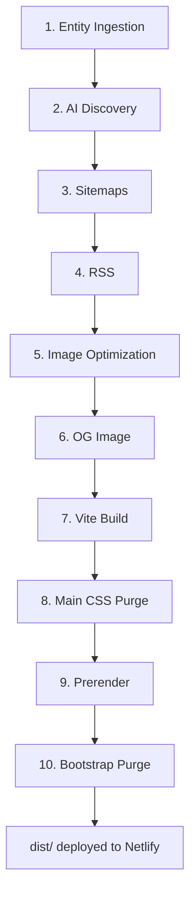

# Build Pipeline

360Ghar's `npm run build` is a 10-stage pipeline that ingests external entity data, generates SEO/AI-discovery artifacts, builds sitemaps and RSS feeds, optimizes images, runs the Vite production build, purges CSS, and prerenders pages with Puppeteer. Each stage is an idempotent Node.js script in `scripts/`; the orchestrator is the `build` script in `package.json`.

## Key Files

| File | Role |
|------|------|
| `package.json` | `build` script orchestrator + `build:*` sub-scripts |
| `netlify.toml` | Netlify build command, env vars, redirects, headers |
| `scripts/ingest-gurgaon-entities.mjs` | Stage 1a: fetch external sitemaps |
| `scripts/merge-entities.mjs` | Stage 1b: merge + dedupe |
| `scripts/build-localities-json.mjs` | Stage 1c: `localities.json` |
| `scripts/build-localities-index.mjs` | Stage 1d: `localities-index.json` |
| `scripts/generate-locality-sitemap.mjs` | Stage 1e + 3: locality sitemap |
| `scripts/write-ai-discovery.mjs` | Stage 2: AI discovery artifacts |
| `scripts/generate-sitemaps.mjs` | Stage 3: static + landing sitemaps |
| `scripts/generate-datahub-sitemap.mjs` | Stage 3: data hub sitemap |
| `scripts/generate-dynamic-sitemaps.mjs` | Stage 3: property + dynamic sitemaps |
| `scripts/generate-rss.mjs` | Stage 4: RSS feeds |
| `scripts/optimize-images.mjs` | Stage 5: AVIF/WebP image variants |
| `scripts/generate-og-image.mjs` | Stage 6: OG image |
| `vite.config.js` | Stage 7: Vite production build |
| `scripts/purge-main-css.mjs` | Stage 8: PurgeCSS on main entry |
| `scripts/generate-prerender-routes.mjs` | Stage 9a: prerender route manifest |
| `scripts/fetch-prerender-data.mjs` | Stage 9b: bulk API data bundle |
| `scripts/prerender-pages.mjs` | Stage 9c: Puppeteer prerendering (concurrent + cached) |
| `scripts/lib/prerenderCache.mjs` | Stage 9 cache: content-hash HTML cache |
| `scripts/purge-bootstrap.mjs` | Stage 10: PurgeCSS on Bootstrap |

## The `build` Script

```json
"build": "npm run build:entities && npm run build:ai-discovery && npm run build:sitemaps && npm run build:rss && npm run build:images && node scripts/generate-og-image.mjs && vite build && node scripts/purge-main-css.mjs && npm run build:prerender && node scripts/purge-bootstrap.mjs"
```

Sub-scripts:

```json
"build:entities": "node scripts/ingest-gurgaon-entities.mjs && node scripts/merge-entities.mjs && node scripts/build-localities-json.mjs && node scripts/build-localities-index.mjs && node scripts/generate-locality-sitemap.mjs",
"build:ai-discovery": "node scripts/write-ai-discovery.mjs",
"build:sitemaps": "node scripts/generate-sitemaps.mjs && node scripts/generate-locality-sitemap.mjs && node scripts/generate-datahub-sitemap.mjs && node scripts/generate-dynamic-sitemaps.mjs",
"build:rss": "node scripts/generate-rss.mjs",
"build:images": "node scripts/optimize-images.mjs --quiet",
"build:prerender": "npm run build:prerender-routes && node scripts/fetch-prerender-data.mjs && node scripts/prerender-pages.mjs",
"build:prerender-routes": "node scripts/generate-prerender-routes.mjs",
"build:prerender-data": "node scripts/fetch-prerender-data.mjs"
```

## Stages in Order

### 1. Entity Ingestion (`build:entities`)

1. **ingest-gurgaon-entities.mjs** - fetches sitemaps from Magicbricks, SquareYards, NoBroker, CommonFloor; extracts `<loc>` URLs matching `gurgaon|gurugram`; decodes locality/society/project names. Output: `scripts/reports/entity-raw.json`.
2. **merge-entities.mjs** - dedupes + merges raw entities.
3. **build-localities-json.mjs** - writes `src/data/localities.json`.
4. **build-localities-index.mjs** - writes `src/data/localities-index.json` (sorted, slugged).
5. **generate-locality-sitemap.mjs** - writes `public/sitemap-localities.xml`.

`isPlaceholderName()` filters junk tokens; each entity carries `confidence` and `sourceCoverage`. See [SEO & Programmatic](../features/SEO-Programmatic).

### 2. AI Discovery (`build:ai-discovery`)

**write-ai-discovery.mjs** calls `buildAiDiscoveryArtifacts()` from `src/seo/aiDiscovery.js` and enriches the feed with the top 50 localities + 20 societies from `localities-index.json`. Outputs:

- `public/.well-known/ai.txt`
- `public/.well-known/api-catalog`
- `public/llms.txt`
- `public/llms-full.txt`
- `public/data/llm-feed.json`

### 3. Sitemap Generation (`build:sitemaps`)

1. **generate-sitemaps.mjs** - `sitemap.xml` (index), `sitemap-static.xml`, `sitemap-landing.xml`. Emits hreflang alternates (`en`, `hi`, `x-default`) for every URL, prunes via `src/data/pseo-prune-list.json`, and supports `SITEMAP_MAX_LANDING_PER_CITY` / `SITEMAP_BATCH` for phased releases.
2. **generate-locality-sitemap.mjs** - `sitemap-localities.xml` (re-run; idempotent).
3. **generate-datahub-sitemap.mjs** - `sitemap-datahub.xml`.
4. **generate-dynamic-sitemaps.mjs** - `sitemap-properties.xml` + any dynamic batches (fetches live properties from the API).

### 4. RSS Generation (`build:rss`)

**generate-rss.mjs** fetches blog posts and properties via `scripts/lib/paginatedApi.mjs`, plus localities from `localities-index.json`. Outputs:

- `public/rss.xml` - main feed (blog + properties)
- `public/rss/localities.xml` - locality feed

Each item is XML-escaped and dated with `toRfc2822()`.

### 5. Image Optimization (`build:images`)

**optimize-images.mjs** uses `sharp` to generate next-gen variants for every PNG/JPG under `public/assets/images` (above 50KB):

- `<name>.webp` (quality 80)
- `<name>.avif` (quality 50)
- For "responsive" hero/banner art, also width-constrained variants at 320 / 640 / 768 / 1024 px in both WebP + AVIF.

Idempotent: outputs are skipped if newer than the source. Flags: `--force` (regenerate all), `--quiet` (summary only).

### 6. OG Image Generation

**generate-og-image.mjs** resizes `public/assets/images/thumbs/banner-three.webp` to 1200x630 JPG (quality 85, progressive) at `public/og-image-home.jpg` for Open Graph / Twitter cards.

### 7. Vite Production Build

`vite build` runs the standard Vite production build (React plugin, SCSS, code-splitting, compression plugin, PWA plugin, bundle visualizer). Output: `dist/`.

### 8. Main CSS Purge

**purge-main-css.mjs** runs PurgeCSS on the main entry CSS chunk (`dist/assets/index-[hash].css`, ~179KB from `main.scss` + component styles). Scans built HTML/JS + source JSX for used selectors, with a safelist for dynamic classes (`show`, `collapsing`, `collapse`, `modal`, etc.). Reduces the entry chunk significantly.

### 9. Prerendering (`build:prerender`)

1. **generate-prerender-routes.mjs** - builds `scripts/prerender-routes.json` from `indexableStaticRoutes`, `seedLandingPrerenderRoutes`, `seedLocalityPrerenderRoutes`, and locality data. Each route has `waitForSelector` / `waitForText` / `waitForTitle`.
2. **fetch-prerender-data.mjs** - pre-fetches a single bulk bundle of the high-value API payloads (recommendations, default + per-route property searches, blog posts) keyed by the same `buildRequestKey` the SPA adapter uses. Writes `dist/prerender-data.json` = `{ meta, entries: { [requestKey]: payload } }`. During capture the SPA reads from this bundle instead of firing live calls per route, so production prerender no longer hammers the backend with 244 × live requests. In bulk mode, unknown keys fall through to live requests; non-production `empty` mode returns empty payloads. Never fails the build on a network error.
3. **prerender-pages.mjs** - spawns `vite preview` on `127.0.0.1:4317`, launches headless Puppeteer (`--no-sandbox` on Linux), and renders each route. Optimizations:
   - **Concurrency** (`PRERENDER_CONCURRENCY`, default 5, clamped 1-8): a bounded worker pool renders multiple routes in parallel against one shared browser (one page per route).
   - **Content-hash cache** (`PRERENDER_CACHE_DIR`, default `node_modules/.cache/prerender-html`): Netlify persists this across builds. Each route's cache key is sha256 over the vite build hash (`dist/.vite-build-hash`), the bulk-data bundle hash, the route config, and the algorithm source hash. Unchanged routes skip the Puppeteer render and copy cached HTML to `dist/`. Disable with `PRERENDER_CACHE_DISABLED=1`.
   - **Request interception**: aborts maps/analytics/fonts/service-worker during capture (defense-in-depth alongside the in-app `isPrerendering()` short-circuits).
   - **Lower timeouts**: per-route wait lowered from 60s to 20s (`waitForText` 10s) so flaky routes fail fast.

   Per route: sets `window.__PRERENDER_INJECTED = { isPrerendering: true }`, navigates, waits for the configured signal, serializes `page.content()` to `dist/<route>.html`, and rewrites stylesheets to be non-blocking.

The `isPrerendering` flag is checked by `authStore.initializeAuth`, `locationStore.initializeLocation`, `posthogService.init`, and `main.jsx` to skip network calls. The bulk-data adapter in `src/services/http.js` (`__PRERENDER_DATA_SOURCE__` define) serves from `dist/prerender-data.json` during production capture; non-production builds use the `'empty'` short-circuit.

### 10. Bootstrap Purge

**purge-bootstrap.mjs** runs PurgeCSS on `public/assets/css/bootstrap.min.css` (~190KB) against built HTML/JS + source JSX, reducing it to ~40-50KB. Safelist preserves dynamically-added classes (`show`, `collapsing`, `collapse`, `modal`, `tooltip`, `popover`, `fade`, `active`, `disabled`, `open`, `btn-`, `form-`, and `col-` responsive variants).

## Build Pipeline Diagram



## Netlify Deployment

`netlify.toml` config:

```toml
[build]
  publish = "dist"
  command = "npx puppeteer browsers install chrome && npm run build"

[build.environment]
  PUPPETEER_CACHE_DIR = "./node_modules/.cache/puppeteer"
  NODE_VERSION = "20"
  VITE_API_SERVER = "https://api.360ghar.com"
  VITE_API_BASE_URL = "https://api.360ghar.com/api/v1"
  PRERENDER_CONCURRENCY = "5"
  PRERENDER_CACHE_DIR = "node_modules/.cache/prerender-html"
```

Puppeteer's Chrome is installed explicitly before the build so prerendering works in Netlify's CI. Netlify persists `node_modules/.cache` across builds, so the content-hash prerender cache survives deploys and skips unchanged renders. Prerender tuning env vars:

| Var | Default | Effect |
|-----|---------|--------|
| `PRERENDER_CONCURRENCY` | `5` | Parallel Puppeteer pages (clamped 1-8) |
| `PRERENDER_CACHE_DIR` | `node_modules/.cache/prerender-html` | Where cached HTML + manifest live |
| `PRERENDER_CACHE_DISABLED` | unset | `1` forces every route to render |
| `PRERENDER_DATA_DISABLED` | unset | `1` writes an empty bulk bundle |
| `VITE_PRERENDER_DATA_SOURCE` | `bulk` (prod) / `empty` (other) | Overrides the SPA adapter data source |

Key redirects:

- `www.360ghar.com` -> `360ghar.com` (301)
- trailing-slash normalization (301)
- `/gurugram/*` -> `/gurgaon/*` (301)
- `/apartments` -> `/flats` (301, all intents)
- Hindi equivalents under `/hi/*`
- SPA catch-all `/*` -> `/index.html` (200)

Cache headers: hashed JS/CSS/fonts are `immutable` (1 year); images 30 days + `stale-while-revalidate`; HTML always revalidates; service worker never cached. The root `/` advertises AI-discovery `Link` headers (RFC 8288) for `api-catalog`, `service-doc`, `service-meta`, `mcp-server`, `agent-skills`, `llms-txt`, `openid-configuration`.

## Dependency Constraints

- **ESLint** must stay on major version 9 (`@eslint/js` ^9.39.4). `eslint-plugin-react@7.x` declares `peerDependency: eslint ^2 || ... || ^9` and does not support eslint 10+. Upgrading to eslint 10 causes Netlify `npm install` to fail with `ERESOLVE`.
- **Node** >= 18 (Netlify pins 20).
- **Puppeteer** ^24.40.0 (devDependency) for prerendering.
- **sharp** ^0.34.5 for image optimization.
- Before upgrading any devDependency to a new major, check peer ranges with `npm info <pkg> peerDependencies`, run `npm install` locally, and run `npm run build && npm run lint`.

## Cross-References

- [SEO & Programmatic](../features/SEO-Programmatic) - what the sitemap/prerender stages produce
- [Internationalization](../features/Internationalization) - Hindi hreflang twins in sitemaps
- [Authentication](../features/Authentication) - prerender skips auth init
- [Analytics](../features/Analytics) - prerender skips PostHog
