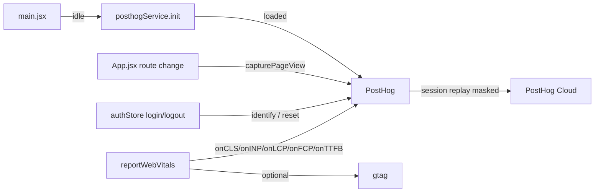

# Analytics

360Ghar uses **PostHog** for product analytics, session replay, and Core Web Vitals (CWV) capture. The integration is lazy-loaded after first paint, gated behind production + an env var, and fully skipped during prerendering so Puppeteer captures are analytics-free. All wrappers fail silently so a PostHog outage never breaks the UI.

## Key Files

| File | Role |
|------|------|
| `src/services/posthogService.js` | PostHog init + safe capture wrappers |
| `src/seo/reportWebVitals.js` | Core Web Vitals capture (web-vitals + PostHog) |
| `src/main.jsx` | Lazy-loads PostHog on idle; starts CWV reporting |
| `src/store/authStore.js` | Identifies / resets user in PostHog on auth changes |
| `src/App.jsx` | SPA pageview tracking on route changes |

## PostHog Service (`posthogService.js`)

`init()` is the single entry point. It is **idempotent** (guarded by `initPromise`) and short-circuits when:

- `window.__PRERENDER_INJECTED?.isPrerendering` is true (Puppeteer capture), or
- `!import.meta.env.PROD`, or
- `!import.meta.env.VITE_PUBLIC_POSTHOG_KEY`.

The SDK is dynamically `import('posthog-js')` so it never enters the main bundle.

### Init config

```js
posthog.init(VITE_PUBLIC_POSTHOG_KEY, {
  api_host: VITE_PUBLIC_POSTHOG_HOST,
  autocapture: false,            // no automatic event capture
  capture_pageview: false,       // we fire $pageview manually
  session_recording: {
    maskAllInputs: true,
    maskTextClass: 'ph-mask',
    blockClass: 'ph-no-capture',
    recordHeaders: false,
    recordBody: false,
  },
  loaded: (ph) => { ph.capture('$pageview'); initialPageviewCaptured = true; },
});
```

### Exported wrappers

| Function | Purpose |
|----------|---------|
| `init()` | Lazy-load + init PostHog |
| `captureEvent(name, properties)` | Safe `posthog.capture` |
| `capturePageView()` | Fires `$pageview` (skips the first - handled in `loaded`) |
| `identifyUser(userId, userProperties)` | `posthog.identify` |
| `resetUser()` | `posthog.reset` on logout |

Every wrapper is wrapped in `try/catch` and silently no-ops if `posthogInstance` is null.

## Initialization Lifecycle (`main.jsx`)

1. React renders the app.
2. On `requestIdleCallback` (or `setTimeout(2000)` fallback for Safari), `posthogService.init()` runs.
3. `requestAnimationFrame(() => reportWebVitals())` starts CWV measurement after first paint.

```js
const loadAnalytics = () => {
  if (window.__PRERENDER_INJECTED?.isPrerendering) return;
  posthogService.init();
};
if ('requestIdleCallback' in window) {
  requestIdleCallback(loadAnalytics);
} else {
  setTimeout(loadAnalytics, 2000);
}
requestAnimationFrame(() => reportWebVitals());
```

## SPA Pageview Tracking

Because `capture_pageview: false`, the app fires `$pageview` manually:

- The **initial** pageview fires inside PostHog's `loaded` callback.
- **Subsequent** route changes call `posthogService.capturePageView()` from the route-change effect in `App.jsx` (in `ScrollToTop` / `RouteScrollToTop`). `capturePageView()` skips the first call (the initial pageview is already captured) via the `initialPageviewCaptured` flag.

## User Identity

`authStore` is the single source of user identity:

- On successful login / profile sync, `posthogService.identifyUser(userProfile.id, { email, name, phone })` is called.
- On `SIGNED_OUT` / `logout()`, `posthogService.resetUser()` clears the identity so subsequent events are anonymous.

This means session replays are tied to the authenticated user once they log in, and detached on logout.

## Core Web Vitals (`reportWebVitals.js`)

Uses the `web-vitals` library (^4.2.4):

```js
import { onCLS, onINP, onLCP, onFCP, onTTFB } from 'web-vitals';
```

Each metric is sent to:

1. **Google Analytics** (`window.gtag`) if present - as a `web_vitals` event with `metric_id`, `value` (CLS multiplied by 1000 to keep it an integer), and `non_interaction: true`.
2. **PostHog** - as a `web_vitals` event with `metric_name`, `value`, `metric_id`, and `rating` (the web-vitals rating: `'good' | 'needs-improvement' | 'poor'`).

In dev (no gtag), metrics are logged to the console for visibility.

## Privacy Considerations

- **Session replay masks all inputs** (`maskAllInputs: true`) - typed text is never recorded.
- **`ph-mask` class** masks specific text elements; **`ph-no-capture`** blocks specific elements entirely.
- **No network recording** (`recordHeaders: false`, `recordBody: false`).
- **No autocapture** - only explicit events are sent.
- **Skipped during prerender** - Puppeteer captures generate zero analytics.
- **Lazy-loaded** - PostHog is not in the main bundle and only loads on idle, so it never affects LCP/INP.

## Analytics Flow



## Cross-References

- [Authentication](../features/Authentication) - user identity for PostHog
- [State Management](../state/State-Management) - authStore identify/reset calls
- [Build Pipeline](../build/Build-Pipeline) - prerendering skips analytics
