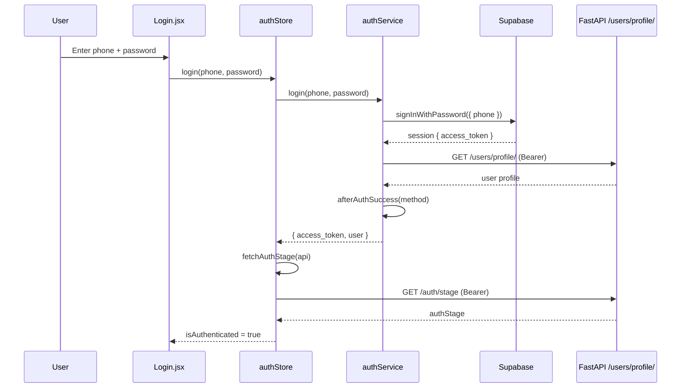

# Authentication

360Ghar authenticates users with the **Supabase Auth SDK** directly from the browser. There are no backend `/api/v1/auth/*` login or register endpoints - the FastAPI backend only validates the Supabase-issued JWT in the `Authorization` header. This keeps session management, token refresh, and OAuth entirely SDK-managed and avoids reintroducing a parallel password store.

## Key Files

| File | Role |
|------|------|
| `src/services/supabaseClient.js` | Lazy Supabase SDK singleton; session/token helpers |
| `src/services/authService.js` | Login, OTP, Google OAuth, password flows |
| `src/services/lastAuthMethod.js` | Last-used auth method persistence |
| `src/store/authStore.js` | Auth state machine + Supabase subscription |
| `src/utils/authStage.js` | Backend auth gate (`fetchAuthStage`) |
| `src/components/account/AccountSection.jsx` | Account dashboard (gated by auth) |
| `src/common/ProfileCompletionRouteGuard.jsx` | Global route guard for `profile_completion` stage |
| `src/pages/account/AuthCallbackPage.jsx` | Google OAuth redirect handler at `/auth/callback` |
| `src/pages/account/McpLogin.jsx` | MCP login for AI assistants |
| `src/pages/account/Login.jsx` | Phone/email + password, OTP, Google |
| `src/pages/account/Register.jsx` | Registration |
| `src/pages/account/ForgotPassword.jsx` | OTP-based password reset |
| `src/pages/account/ResetPassword.jsx` | Set new password after OTP |
| `src/pages/account/ProfileCompletion.jsx` | Profile completion step |
| `src/pages/account/AddPhonePage.jsx` | Attach phone after Google signup |
| `src/pages/account/AccountDeletionRequest.jsx` | Deletion request form |
| `src/services/deletionService.js` | Deletion request API |

## Supabase Client (`supabaseClient.js`)

The Supabase SDK (~152KB) is **lazy-loaded** on first use via dynamic `import('@supabase/supabase-js')`, not bundled into the initial page. The singleton is created with:

```js
createClient(SUPABASE_URL, SUPABASE_PUBLISHABLE_KEY, {
  auth: {
    persistSession: true,
    autoRefreshToken: true,
    detectSessionInUrl: false, // AuthCallbackPage exchanges the code explicitly
  },
});
```

`detectSessionInUrl: false` prevents a double-exchange race with the manual `exchangeCodeForSession()` call in `AuthCallbackPage`.

Exported helpers: `ensureSupabaseClient()`, `getSupabaseSession()`, `getSupabaseAccessToken()`, `refreshSupabaseSession()`, `onSupabaseAuthStateChange(callback)`.

Missing env vars (`VITE_SUPABASE_URL`, `VITE_SUPABASE_PUBLISHABLE_KEY`) only warn at import; the throw is deferred to first use so error boundaries can recover (audit fix 5.1).

## Auth Methods

| Method | Flow |
|--------|------|
| Phone + password | `signInWithPassword({ phone })` (E.164 normalized) |
| Email + password | `signInWithPassword({ email })` |
| Phone OTP | `signInWithOtp({ phone, shouldCreateUser })` -> `verifyOtp({ type: 'sms' })` |
| Email OTP | `signInWithOtp({ email, shouldCreateUser })` -> `verifyOtp({ type: 'email' })` (6-digit code, not magic link) |
| Google OAuth | `signInWithOAuth({ provider: 'google', redirectTo: /auth/callback })` -> code exchange |
| Set password after OTP signup | `updateUser({ password })` |
| Add phone to Google account | `updateUser({ phone })` -> `verifyOtp({ type: 'phone_change' })` |
| Reset password | OTP verify, then `updateUser({ password })` |
| Change password | Re-sign-in to verify current, then `updateUser({ password })` |

`shouldCreateUser` defaults to **false** for login and reset sends, so a mistyped identifier never silently creates an account. `lastAuthMethod.js` tracks the last-used method locally and mirrors it to the backend best-effort.

## authStore State Machine

`initializeAuth()` runs once on app load:

1. Subscribe to `onAuthStateChange`.
2. Read `getSupabaseAccessToken()`. If absent, clear state.
3. If a cached user younger than 1 hour exists in `localStorage['user']`, render it immediately for instant UI.
4. Fetch a fresh profile via `authService.getCurrentUser()` and the auth stage via `fetchAuthStage(api)`.

`authStage` (from the backend) gates onboarding: `identifier_verification`, `password_setup`, `profile_completion`, `app_onboarding`, `active`. `ProfileCompletionRouteGuard` redirects authenticated users with `authStage === 'profile_completion'` to `/profile-completion`, except for exempt routes (`/auth/callback`, `/add-phone`, `/login`, `/register`, `/profile-completion`).

**Critical behavior:** a transient profile-fetch failure does **not** log the user out (audit fix 1.1). Only an explicit `SIGNED_OUT` event clears auth state, so a token refresh race or temporary backend hiccup cannot kill a session.

## 401 Handling

The axios response interceptor (see [API Layer](../services/API-Layer)):

1. On `401` with `withAuth`, calls `refreshSupabaseSession()`. If a new token arrives, retries the request once.
2. If refresh fails and the request is not on the public allowlist, clears `localStorage['user']`. Route guards then redirect to `/login`.

## Google OAuth Callback

`AuthCallbackPage` at `/auth/callback`:

1. Reads `code` and `next` from the URL. `sanitizeNext()` only allows same-site, single-leading-slash paths.
2. `authService.exchangeCodeForSession(code)`.
3. `authService.afterAuthSuccess(AUTH_METHODS.GOOGLE)`.
4. `syncAfterExternalAuth()` syncs the auth store.
5. If the Google user has no phone, redirect to `/add-phone` (skippable); otherwise navigate to `next`.

## MCP Login (`McpLogin.jsx`)

`/mcp/login` is opened by MCP clients (Claude, ChatGPT, Cursor, Factory) as part of a browser-based OAuth-style flow. It reuses the standard `login()` action, then redirects back to the client's `redirect_uri` with the access token in the **URL fragment** (never a query parameter, to avoid server logs / Referer leaks - audit fix 1.2 / 1.11).

`ALLOWED_MCP_ORIGINS` is an allowlist: `localhost:3000`, `localhost:5173`, `claude.ai`, `chatgpt.com`, `chat.openai.com`, `cursor.sh`, `app.factory.ai`. Disallowed origins get a clear error page.

## Account Deletion

`deletionService.js` (audit fix 1.3 - replaced a third-party Formspree form):

- `submitDeletionRequest({ email, deletion_type, reason, message })` -> `POST /account/delete-request/` (authenticated, but email is the primary key so anonymous GDPR requests work).
- `getDeletionRequestStatus(id)` -> `GET /account/delete-request/{id}/status/` (public).
- `cancelDeletionRequest(id)` -> `POST /account/delete-request/{id}/cancel/`.

## Auth Flow Sequence



## No Backend Auth Endpoints

The backend exposes only auxiliary auth routes - never login/register:

- `POST /auth/identifier-status` (public) - login state machine
- `POST /auth/last-method` (auth) - mirror last method

All credential verification happens in Supabase. Reintroducing backend `/api/v1/auth/*` login/register flows is explicitly disallowed by the repo guidelines.

## Cross-References

- [API Layer](../services/API-Layer) - the axios instances and 401 handling
- [State Management](../state/State-Management) - authStore internals
- [SEO & Programmatic](../features/SEO-Programmatic) - prerendering skips auth init
