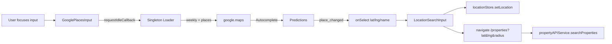

# Maps & Places

360Ghar integrates Google Maps and Places for location-based property search. The `@googlemaps/js-api-loader` is loaded as a singleton, autocomplete is bound lazily on first focus, and selected locations flow into `locationStore` and the property search query. The API key is the only required Google credential.

## Key Files

| File | Role |
|------|------|
| `src/common/search/GooglePlacesInput.jsx` | Google Places Autocomplete input |
| `src/common/search/LocationSearchInput.jsx` | Places input + radius selector -> property search |
| `src/common/search/SearchBox.jsx` | Header search box |
| `src/common/forms/SimplifiedFilter.jsx` | Simplified filter with Places |
| `src/components/property-filters/AdvancedPropertyFilter.jsx` | Advanced filter using Places |
| `src/components/property-filters/PropertyTopBar.jsx` | Top bar search |
| `src/components/layout/MapLocationSection.jsx` | Interactive map section |
| `src/pages/MapLocation.jsx` | Map-based search page |
| `src/pages/properties/PostProperty.jsx` | Listing form with Places address |
| `src/store/locationStore.js` | Geolocation + selected location |

## Environment

```
VITE_GOOGLE_PLACES_API_KEY=<your-key>
```

The key is consumed only inside `GooglePlacesInput.jsx`. If it is missing or still set to the placeholder `your_google_places_api_key_here`, the loader logs an error and the input falls back to manual entry.

## Google Maps JS API Loader

`GooglePlacesInput.jsx` creates a module-level singleton loader:

```js
const loader = new Loader({
  apiKey: import.meta.env.VITE_GOOGLE_PLACES_API_KEY,
  version: 'weekly',
  libraries: ['places'],
  id: 'google-maps-js',
});
```

`preload()` kicks off `loader.load()` once and caches the promise; subsequent inputs reuse the same loaded library. The library is fetched on `requestIdleCallback` (or `setTimeout(1000)` fallback) so it never blocks first paint or LCP.

## GooglePlacesInput Component

| Prop | Default | Purpose |
|------|---------|---------|
| `placeholder` | `'Search location'` | Input placeholder |
| `onSelect({ lat, lng, name })` | - | Called on `place_changed` |
| `className` | `''` | Input class |
| `restrictCountry` | `'in'` | `componentRestrictions.country` |
| `types` | `[]` | Place types filter |

Behavior:

1. On input `focus`, init Autocomplete (idempotent - guarded by `autocompleteRef` / `initPromiseRef`).
2. Fields requested: `formatted_address`, `geometry`, `name`.
3. On `place_changed`, extract `lat` / `lng` (handles both function and value forms) and call `onSelect`.
4. A spinner is shown while the Places library is still loading (`isPlacesLoading`) so the dropdown isn't silently blank (audit fix 5.8).
5. Cleanup on unmount removes listeners and nulls refs.

## LocationSearchInput

`src/common/search/LocationSearchInput.jsx` wraps `GooglePlacesInput` and adds a radius selector (5 / 10 / 20 / 50 / 100 km). On selection it:

1. `setLocation({ lat, lng, name })` into `locationStore`.
2. Builds a `URLSearchParams` with `lat`, `lng`, `radius`, `sort_by=distance`.
3. Navigates to `/properties?...` via `useI18nNavigate()`.

This is the primary path from a typed location to a geo-filtered property search.

## locationStore Integration

`locationStore` (see [State Management](../state/State-Management)) is the bridge between Places selections, browser geolocation, and the property search:

- `setLocation(newLocation)` - called by Places selections.
- `initializeLocation()` - on app load, tries browser geolocation; falls back to Gurgaon (`28.4595, 77.0266`) after 24h or on error.
- `useLocationFallback()` - returns `[isFallback, reason]` so any component can surface a "showing Gurgaon" banner.

Property search reads `lat` / `lng` / `radius` from the filter object (set either by `LocationSearchInput` or by the filter UI), which `buildPropertySearchParams` serializes into the `GET /properties/` query.

## Map-Based Search Page

`/map-location` (`src/pages/MapLocation.jsx`) renders `MapLocationSection`, an interactive map + listings combination. It is `noindex` (an interactive tool, not a crawlable result page). The map uses the same Google Maps loader to render markers and re-queries `propertyAPIService.searchProperties` when the viewport or filter changes.

## Forms Using Places

- `PostProperty.jsx` / listing forms - address autocomplete when posting a property.
- `AdvancedPropertyFilter.jsx` / `PropertyTopBar.jsx` - location filter in the search UI.
- `SimplifiedFilter.jsx` - simplified home-page filter.
- `SearchBox.jsx` - header search.

All reuse the same `GooglePlacesInput` singleton loader, so the Maps library is fetched at most once per page load regardless of how many inputs are mounted.

## Maps Flow



## Cross-References

- [Property Search](../features/Property-Search) - geo-filtered search
- [State Management](../state/State-Management) - locationStore
- [API Layer](../services/API-Layer) - propertyAPIService
