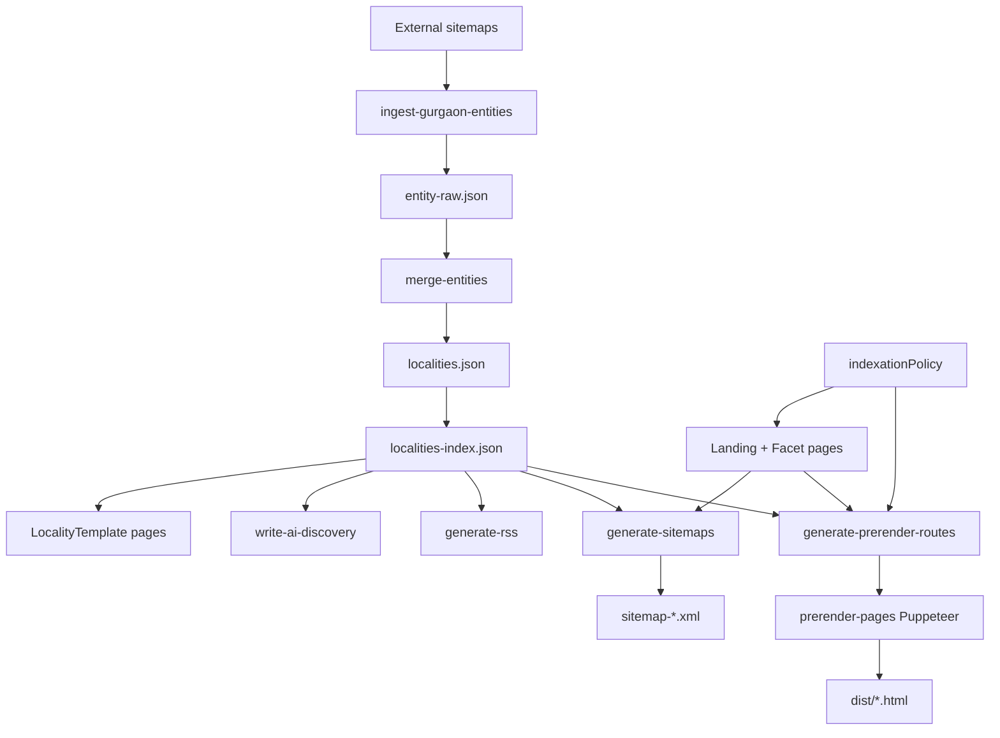

# SEO & Programmatic Pages

360Ghar's growth engine is a programmatic SEO (pSEO) system that generates hundreds of city/intent/type landing pages, faceted BHK/budget/amenity pages, locality pages, sitemaps, RSS feeds, and AI-discovery artifacts at build time. Pages are prerendered with Puppeteer so crawlers receive fully rendered HTML with structured data, hreflang alternates, and internal links.

## Key Files

| File | Role |
|------|------|
| `src/pages/landing/Landing.jsx` | Dynamic landing page `/:citySlug/:intent/:type` |
| `src/pages/landing/FacetLanding.jsx` | Faceted landing pages (BHK / budget / amenity) |
| `src/pages/localities/LocalityTemplate.jsx` | Locality template page |
| `src/seo/indexationPolicy.js` | Approved cities, static routes, budget facets, prerender seeds |
| `src/seo/structuredData.js` | JSON-LD generators (Breadcrumb, FAQ, HowTo, etc.) |
| `src/seo/aiDiscovery.js` | llms.txt, ai.txt, API catalog, LLM feed builder |
| `src/seo/siteMetadata.js` | Default title, description, OG image |
| `src/seo/toolSchemas.js` | Tool-page structured data |
| `src/utils/internalLinks.js` | City normalization, BHK/budget/locality link builders |
| `src/utils/landingKeywords.js` | Landing/facet keyword builders |
| `src/utils/propertyTaxonomy.js` | Property type label/slug normalization |
| `scripts/generate-sitemaps.mjs` | Static + landing sitemaps |
| `scripts/generate-dynamic-sitemaps.mjs` | Property + locality sitemaps |
| `scripts/generate-locality-sitemap.mjs` | Locality sitemap |
| `scripts/generate-datahub-sitemap.mjs` | Data hub sitemap |
| `scripts/ingest-gurgaon-entities.mjs` | Gurgaon entity ingestion |
| `scripts/merge-entities.mjs` | Merge raw entities |
| `scripts/build-localities-json.mjs` | Build `localities.json` |
| `scripts/build-localities-index.mjs` | Build `localities-index.json` |
| `scripts/write-ai-discovery.mjs` | Write llms.txt / ai.txt / llm-feed.json |
| `scripts/generate-rss.mjs` | RSS feed generation |
| `scripts/generate-prerender-routes.mjs` | Build prerender route manifest |
| `scripts/prerender-pages.mjs` | Puppeteer prerendering |

## Dynamic Landing Routes

Defined in `src/App.jsx` and governed by `indexationPolicy.js`:

| Route | Page | Example |
|-------|------|---------|
| `/:citySlug/:intent/:type` | `Landing.jsx` | `/gurgaon/buy/flats` |
| `/:citySlug/:intent/:type/:bhk` | `FacetLanding.jsx` | `/gurgaon/rent/flats/2-bhk` |
| `/:citySlug/:intent/:type/budget/:budget` | `FacetLanding.jsx` | `/gurgaon/buy/flats/budget/under-50-lakhs` |
| `/:citySlug/:intent/:type/amenity/:amenity` | `FacetLanding.jsx` | `/gurgaon/rent/flats/amenity/swimming-pool` |
| `/locality/:slug` | `LocalityTemplate.jsx` | `/locality/dlf-phase-1-gurgaon` |

### `Landing.jsx`

Validates `citySlug` against `approvedIndexableCitySlugs`, normalizes via `normalizeCitySlug()`, and checks `isIndexableCitySlug()` for the `noindex` decision. `intent` is constrained to `buy | rent | pg`; `type` is normalized through `normalizePropertyTypeToken()` and `getPropertyRouteSlug()`. The page:

- Builds a property search query (`buildPropertySearchQuery`) and embeds live results.
- Generates FAQ structured data via `buildLandingFaqs()` (8 Q&As, i18n-aware with Hindi verb variants).
- Emits Breadcrumb + FAQ JSON-LD.
- Renders related links (other intents, BHK facets, budget facets, localities) via `getRelatedLandingLinks()`.
- Includes `AiFactSheet` for AI crawlers.

### `FacetLanding.jsx`

Handles three facet types in one component:

- **BHK** - `VALID_BHKS = ['1-bhk','2-bhk','3-bhk','4-bhk','5-bhk']`
- **Budget** - rent (`under-10k`, `under-15k`, `under-20k`) and buy (`under-50-lakhs`, `under-80-lakhs`, `under-1-crore`) from `indexableBudgetFacets`
- **Amenity** - arbitrary amenity slugs

`isIndexableFacetLanding()` decides `noindex`. FAQs are built by `buildFacetFaqs()` with Hindi action variants. Invalid combinations redirect via `<Navigate>`.

## Entity Ingestion Pipeline

`scripts/ingest-gurgaon-entities.mjs` fetches sitemaps from Magicbricks, SquareYards, NoBroker, and CommonFloor, extracts `<loc>` URLs matching `gurgaon|gurugram`, and decodes locality/society/project names from the URL slugs. Output: `scripts/reports/entity-raw.json`.

The pipeline (run by `npm run build:entities`):

1. **ingest-gurgaon-entities** - fetch external sitemaps -> `entity-raw.json`
2. **merge-entities** - dedupe + merge raw entities
3. **build-localities-json** - `src/data/localities.json`
4. **build-localities-index** - `src/data/localities-index.json` (sorted, slugged)
5. **generate-locality-sitemap** - `public/sitemap-localities.xml`

`isPlaceholderName()` filters out junk tokens like `povp abc123`. Each entity carries `confidence` and `sourceCoverage` for quality scoring.

## Sitemap Generation

`npm run build:sitemaps` runs four scripts:

| Script | Output |
|--------|--------|
| `generate-sitemaps.mjs` | `sitemap.xml` (index), `sitemap-static.xml`, `sitemap-landing.xml` |
| `generate-locality-sitemap.mjs` | `sitemap-localities.xml` |
| `generate-datahub-sitemap.mjs` | `sitemap-datahub.xml` |
| `generate-dynamic-sitemaps.mjs` | `sitemap-properties.xml` + any dynamic batches |

### hreflang Alternates

`buildAlternates(enPath)` emits `en`, `hi`, and `x-default` for every URL. Each English URL is paired with its `/hi/` Hindi twin in the same `<url>` block, so Google can serve the correct locale.

### Pruning + Batching

- `src/data/pseo-prune-list.json` - patterns (path, `path/*`, or regex) to exclude.
- `SITEMAP_MAX_LANDING_PER_CITY` / `SITEMAP_BATCH` env vars cap the count per city for phased releases.
- `validateSitemapUrl()` skips redirected patterns (`/gurugram/`, `/apartments`).

## AI Discovery (`write-ai-discovery.mjs`)

`buildAiDiscoveryArtifacts()` from `src/seo/aiDiscovery.js` produces:

| Artifact | Path | Purpose |
|----------|------|---------|
| `llms.txt` | `public/llms.txt` | Concise LLM-readable site summary |
| `llms-full.txt` | `public/llms-full.txt` | Expanded version |
| `ai.txt` | `public/.well-known/ai.txt` | AI crawler policy |
| `api-catalog` | `public/.well-known/api-catalog` | `application/linkset+json` API catalog |
| `llm-feed.json` | `public/data/llm-feed.json` | Structured feed enriched with top 50 localities + 20 societies |

The script reads `localities-index.json` to enrich `feed.top_localities` and `feed.top_societies` and set `metadata.total_localities` / `total_societies`.

`netlify.toml` advertises these via `Link` headers on `/` (RFC 8288): `api-catalog`, `service-doc`, `service-meta`, `mcp-server`, `agent-skills`, `llms-txt`, `openid-configuration`.

## RSS Feed (`generate-rss.mjs`)

Fetches blog posts and properties via `fetchPaginatedCollectionParallel` from `scripts/lib/paginatedApi.mjs`, plus localities from `localities-index.json`, and builds:

- `public/rss.xml` - main feed (blog + properties)
- `public/rss/localities.xml` - locality feed

Each item is XML-escaped and dated with `toRfc2822()`. Property titles synthesize a description from type, purpose, and locality.

## Structured Data / JSON-LD

`src/seo/structuredData.js` generates:

- `generateBreadcrumbStructuredData`
- `generateFaqStructuredData`
- `generateHowToStructuredData`
- Tool-page schemas via `src/seo/toolSchemas.js`

These are emitted through `<Helmet>` in each page's `SEO` component (`src/common/SEO.jsx`).

## Prerendering

`scripts/generate-prerender-routes.mjs` builds `scripts/prerender-routes.json` from `indexableStaticRoutes`, `seedLandingPrerenderRoutes`, `seedLocalityPrerenderRoutes`, and locality data. Each route has a `waitForSelector` / `waitForText` / `waitForTitle` so Puppeteer knows when the page is ready.

`scripts/prerender-pages.mjs`:

1. Spawns `vite preview` on `127.0.0.1:4317`.
2. Launches headless Puppeteer (`--no-sandbox` on Linux for Netlify).
3. For each route, navigates, waits for the configured signal (60s timeout), sets `window.__PRERENDER_INJECTED = { isPrerendering: true }`, and serializes `page.content()` to `dist/<route>.html`.
4. Rewrites stylesheets to be non-blocking (strips duplicate `<noscript>` copies, converts `media="print"` preloads).

The `isPrerendering` flag is checked by `authStore.initializeAuth`, `locationStore.initializeLocation`, `posthogService.init`, and `main.jsx` to skip network calls during prerender.

## SEO Pipeline

## Cross-References

- [Build Pipeline](../build/Build-Pipeline) - how these scripts chain in `npm run build`
- [Internationalization](../features/Internationalization) - Hindi hreflang twins
- [Authentication](../features/Authentication) - prerender skips auth init
