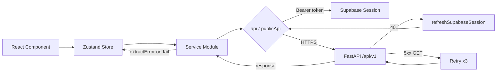

# API Layer

The service layer is the single boundary between 360Ghar's React UI and the FastAPI backend. Every network call, file upload, and Supabase auth interaction flows through one of two axios instances created by a shared factory. Components never call axios directly; they go through a Zustand store (or, for a few read-only public pages, a service module) that delegates to a service, which delegates to an axios instance.

## Key Files

| File | Role |
|------|------|
| `src/services/http.js` | Axios instance factory: HTTPS enforcement, retry, 401 handling |
| `src/services/api.js` | Exports the authenticated `api` and unauthenticated `publicApi` instances |
| `src/services/index.js` | Barrel export for every service module |
| `src/services/supabaseClient.js` | Lazy Supabase SDK singleton; reads tokens for the auth header |
| `src/services/authService.js` | Login, OTP, Google OAuth, password flows |
| `src/services/propertyService.js` | Authenticated property CRUD |
| `src/services/propertyAPIService.js` | Public property search (no auth) |
| `src/services/mediaService.js` | Media upload + metadata |
| `src/services/userService.js` | User profile, preferences, admin user ops |
| `src/services/swipeService.js` | Like/dislike swipe actions |
| `src/services/visitService.js` | Property visit scheduling |
| `src/services/blogService.js` | Blog posts, categories, tags (public + admin) |
| `src/services/pageService.js` | Static page fetcher with batch helper |
| `src/services/utilityService.js` | Amenities, uploads, FAQs, bug reports |
| `src/services/agentService.js` | Assigned-agent lookup |
| `src/services/deletionService.js` | Account deletion / erasure requests |
| `src/services/vastuService.js` | AI Vastu analysis (separate axios, 3-min timeout) |
| `src/services/dataHubService.js` | Data hub regulatory content |
| `src/services/chatService.js` | AI chat assistant |
| `src/services/puterService.js` | Puter.js AI integration |
| `src/services/posthogService.js` | PostHog analytics wrapper |
| `src/utils/apiError.js` | `extractError()` for FastAPI/Pydantic v2 shapes |

## Axios Instance Factory (`http.js`)

`createAxiosInstance({ withAuth, enableRetry })` returns a configured axios instance. Two are created once at module load in `api.js`:

- `api` - `withAuth: true`. The request interceptor calls `getSupabaseAccessToken()` and sets `Authorization: Bearer <token>`.
- `publicApi` - `withAuth: false`. Used for property search, blog reads, public pages, and FAQs so unauthenticated users never receive 401s from a stray bearer token.

### Base URL

`getApiBaseUrl()` returns `import.meta.env.VITE_API_BASE_URL || '/api'`. In dev the Vite proxy rewrites `/api` to `http://localhost:3600/api/v1`. In production `VITE_API_BASE_URL` points at `https://api.360ghar.com/api/v1` (set in `netlify.toml`).

### HTTPS enforcement

`enforceHttpsExceptLocal()` upgrades any `http://` absolute URL to `https://` unless the hostname is `localhost`, `127.0.0.1`, or `::1`. It runs on both `config.baseURL` and `config.url` in the request interceptor, so a misconfigured env var can never ship plaintext credentials.

### Retry policy

- Max retries: **3**, only on **GET** requests.
- Retried status codes: `408, 429, 502, 503, 504`.
- Backoff: `RETRY_DELAY * (attempt + 1)` (1s, 2s, 3s).
- The retry counter is keyed on `Symbol.for('http.retryCount')` and the config is cloned before each retry, so a shared axios config can never leak a counter between unrelated requests (audit fix 5.2).

### 401 handling

On `401`:
1. If `withAuth` and the request has not already been auth-retried, call `refreshSupabaseSession()`. If a fresh access token comes back, clone the config, set the new bearer, and retry once (`Symbol.for('http.authRetry')` guard).
2. If refresh fails, and the request is not on the public-allowlist (`/properties/`, `/properties/recommendations/`), and an `Authorization` header was sent, clear the cached `user` from `localStorage`. Route guards and the auth store handle the redirect to `/login`.

### Timeout

Default **30 seconds**. `vastuService.js` creates its own axios instance with a 180-second timeout because the AI Vastu analysis can take up to three minutes.

## Error Extraction (`utils/apiError.js`)

`extractError(err, fallback)` normalizes Axios errors into a human-readable string. It handles the FastAPI/Pydantic v2 shapes:

- `{ detail: "string" }` - returned verbatim.
- `{ detail: [{ msg: "..." }, ...] }` - messages joined with `, `.
- `{ detail: { msg: "..." } }` - `msg` extracted.
- Plain `Error` - `.message` used.

All Zustand stores wrap service calls in `try/catch`, run `extractError()`, and push the result into the store's `error` field so the UI can render a clean message.

## Service Reference

### authService (`src/services/authService.js`)

All auth runs through the **Supabase Auth SDK** - there are no backend `/api/v1/auth/*` login or register endpoints.

| Method | Endpoint / SDK | Notes |
|--------|----------------|-------|
| `login(phoneOrEmail, password)` | `supabase.auth.signInWithPassword` | Auto-detects email vs phone; normalizes Indian numbers to E.164; then `GET /users/profile/` |
| `signInWithGoogle(next)` | `supabase.auth.signInWithOAuth({ provider: 'google' })` | Redirect to `/auth/callback?code=...` |
| `exchangeCodeForSession(code)` | `supabase.auth.exchangeCodeForSession` | Used by `AuthCallbackPage` |
| `checkIdentifierStatus(identifier)` | `POST /auth/identifier-status` (public) | Login state-machine: exists / verified / has_password / next_step |
| `recordLastMethod(method)` | `POST /auth/last-method` | Best-effort mirror of last auth method |
| `sendPhoneOtp(phone, { shouldCreateUser })` | `supabase.auth.signInWithOtp({ phone })` | `shouldCreateUser: false` for login/reset |
| `verifyPhoneOtp(phone, token)` | `supabase.auth.verifyOtp({ type: 'sms' })` | |
| `sendEmailOtp` / `verifyEmailOtp` | `supabase.auth.signInWithOtp` / `verifyOtp({ type: 'email' })` | 6-digit code, not magic link |
| `setPasswordAfterSignup(password)` | `supabase.auth.updateUser({ password })` | After passwordless signup |
| `startAddPhone` / `verifyAddPhone` | `updateUser({ phone })` / `verifyOtp({ type: 'phone_change' })` | Attach phone to Google account |
| `getCurrentUser()` | `GET /users/profile/` | |
| `updateCurrentUser(data)` | `PUT /users/profile/` | |
| `logout()` | `supabase.auth.signOut()` + `localStorage.removeItem('user')` | |
| `resetPassword(newPassword)` | `supabase.auth.updateUser({ password })` | After OTP-verified reset |
| `changePassword(current, new)` | Re-sign-in to verify, then `updateUser` | |
| `afterAuthSuccess(method, identifier)` | - | Persists last method locally + mirrors to backend |

### userService (`src/services/userService.js`)

| Method | Endpoint |
|--------|----------|
| `getProfile()` | `GET /users/profile` |
| `updateProfile(data)` | `PUT /users/profile` |
| `updatePreferences(prefs)` | `PUT /users/preferences` |
| `updateLocation(location)` | `PUT /users/location` |
| `getNotificationSettings()` | `GET /users/notification-settings` |
| `updateNotificationSettings(s)` | `PUT /users/notification-settings` |
| `getUserById(id)` | `GET /users/{id}` (admin) |
| `getAllUsers(params)` | `GET /users` (admin) |
| `createUser(data)` | `POST /users` (admin) |
| `updateUser(id, data)` | `PUT /users/{id}` (admin) |

### propertyService (`src/services/propertyService.js`) - authenticated CRUD

| Method | Endpoint |
|--------|----------|
| `getAllProperties(filters)` | `GET /properties/` |
| `getUserProperties(params)` | `GET /properties/me` |
| `getPropertyById(id)` | `GET /properties/{id}` |
| `createProperty(data)` | `POST /properties/` |
| `updateProperty(id, data)` | `PUT /properties/{id}` |
| `deleteProperty(id)` | `DELETE /properties/{id}` |

### propertyAPIService (`src/services/propertyAPIService.js`) - public search

Uses `publicApi` (no auth). Search params are built by `buildPropertySearchParams()` in `src/utils/propertyFilters.js`, which cleans nulls/empties and serializes arrays via repeated `params.append`.

| Method | Endpoint |
|--------|----------|
| `searchProperties(filters, page, limit)` | `GET /properties/?...` |
| `getPropertyById(id)` | `GET /properties/{id}` |
| `getRecommendations(limit)` | `GET /properties/recommendations/?limit=` |

### mediaService (`src/services/mediaService.js`)

| Method | Endpoint |
|--------|----------|
| `uploadMedia(formData)` | `POST /upload` (multipart) |
| `listMedia(params)` | `GET /upload/media` |
| `getMedia(id)` | `GET /upload/media/{id}` |
| `updateMedia(id, data)` | `PATCH /upload/media/{id}` |
| `deleteMedia(id)` | `DELETE /upload/media/{id}` |

### swipeService (`src/services/swipeService.js`) - authenticated

| Method | Endpoint |
|--------|----------|
| `recordSwipe({ property_id, is_liked })` | `POST /swipes/` |
| `getSwipes(params)` | `GET /swipes/` |
| `undoLast()` | `DELETE /swipes/undo` |
| `toggle(swipeId)` | `PUT /swipes/{id}/toggle` |
| `stats()` | `GET /swipes/stats` |

### visitService (`src/services/visitService.js`) - authenticated

| Method | Endpoint |
|--------|----------|
| `schedule({ property_id, scheduled_date, special_requirements })` | `POST /visits/` |
| `getAll()` | `GET /visits/` |
| `getUpcoming()` | `GET /visits/upcoming` |
| `getPast()` | `GET /visits/past` |
| `getById(id)` | `GET /visits/{id}` |
| `update(id, data)` | `PUT /visits/{id}` |
| `reschedule(id, data)` | `POST /visits/{id}/reschedule` |
| `cancel(id, data)` | `POST /visits/{id}/cancel` |

### blogService (`src/services/blogService.js`)

Reads use `publicApi`; admin writes use `api`.

| Method | Endpoint |
|--------|----------|
| `getPosts(params)` | `GET /blog/posts` (public) |
| `getPostByIdentifier(idOrSlug)` | `GET /blog/posts/{id}` (public) |
| `getCategories(params)` / `getCategoryByIdentifier(id)` | `GET /blog/categories[/{id}]` (public) |
| `getTags(params)` / `getTagByIdentifier(id)` | `GET /blog/tags[/{id}]` (public) |
| `createPost(data)` | `POST /blog/posts` (admin) |
| `updatePost(id, data)` | `PUT /blog/posts/{id}` (admin) |
| `deletePost(id)` | `DELETE /blog/posts/{id}` (admin) |

### pageService (`src/services/pageService.js`) - public

`getPublicPage(uniqueName)` hits `GET /pages/{name}/public` and normalizes the response (unwraps `data.page` / `data`). `getManyPublicPages(names[])` runs `Promise.allSettled` and returns a `{ [name]: { page, error } }` map so one failure does not break a batch.

### utilityService (`src/services/utilityService.js`)

| Method | Endpoint | Auth |
|--------|----------|------|
| `getAmenities()` | `GET /amenities/` | yes |
| `uploadFile(file)` | `POST /upload/` (multipart) | yes |
| `getPublicFAQs(params)` | `GET /faqs/public` | **public** (audit fix 5.3) |
| `getPageByUniqueName(name)` | `GET /pages/{name}/public` | public |
| `reportBug(data)` | `POST /bugs/` | yes |
| `checkAppUpdate(data)` | `POST /versions/check` | yes |

### agentService (`src/services/agentService.js`)

`getAssignedAgent()` -> `GET /agents/assigned/`.

### deletionService (`src/services/deletionService.js`)

Account deletion / GDPR erasure (audit fix 1.3 - replaced a third-party Formspree form with a backend contract).

| Method | Endpoint |
|--------|----------|
| `submitDeletionRequest(data)` | `POST /account/delete-request/` |
| `getDeletionRequestStatus(id)` | `GET /account/delete-request/{id}/status/` (public) |
| `cancelDeletionRequest(id)` | `POST /account/delete-request/{id}/cancel/` |

### vastuService (`src/services/vastuService.js`)

Creates its own axios instance (not from the factory) so it can bypass Netlify's 26s proxy timeout in production by hitting `VITE_API_SERVER` directly, with a 180-second timeout.

| Method | Endpoint |
|--------|----------|
| `analyzeFloorPlan(imageFile, northDirection, notes)` | `POST /vastu/analyze` (multipart) |
| `checkHealth()` | `GET /vastu/health` |

North directions: `'up' | 'down' | 'left' | 'right' | 'unknown'`. The default AI provider is `glm` (GLM-4V-Flash).

## Request Flow

## Cross-References

- [State Management](../state/State-Management) - how stores consume these services
- [Authentication](../features/Authentication) - the Supabase auth flow in detail
- [Property Search](../features/Property-Search) - the 31-filter public search API
- [Specialized Tools](../tools/Specialized-Tools) - the Vastu service's long-timeout instance
