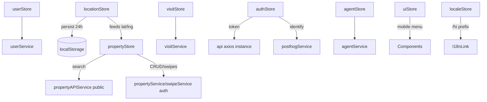

# State Management

360Ghar uses **Zustand 5** as its primary state library, with a small amount of React Context for legacy cross-component data passing. Every store lives in `src/store/` and is re-exported from `src/store/index.js`. Stores own their data shape, loading flags, error string, and the actions that call into the [API Layer](../services/API-Layer). Components subscribe with selector hooks (`useAuthStore(s => s.user)`) so only the slices they care about re-render.

## Key Files

| File | Scope |
|------|-------|
| `src/store/index.js` | Barrel export of all stores |
| `src/store/authStore.js` | Supabase session, user profile, auth stage |
| `src/store/propertyStore.js` | Property search, CRUD, swipes, filters, pagination |
| `src/store/userStore.js` | Profile, preferences, location |
| `src/store/locationStore.js` | Geolocation, 24h persistence, Gurgaon fallback |
| `src/store/visitStore.js` | Property visit lifecycle |
| `src/store/agentStore.js` | Assigned agent |
| `src/store/uiStore.js` | Mobile menu + off-canvas UI flags |
| `src/store/blogStore.js` | Blog data + current month label |
| `src/store/localeStore.js` | Active locale (`en` / `hi`) |
| `src/store/chatStore.js` | AI chat assistant state |
| `src/store/dataHubStore.js` | Data hub regulatory content |
| `src/store/compareStore.js` | Property comparison |
| `src/contextApi/BlogDataContext.jsx` | Legacy React Context for blog data |

## Conventions

- Each store is created with `create((set, get) => ({ ... }))`.
- Async actions set `isLoading: true` at the start, `isLoading: false` in `finally`, and push errors through `extractError()` from `src/utils/apiError.js`.
- A `clearError()` action is exposed on every store.
- Loading is split: `isLoading` blocks the page UI; `isSwipeLoading` (in `propertyStore`) runs background swipe operations without blocking.
- Persisted stores use Zustand's `persist` middleware with `partialize` to whitelist only serializable fields.

## authStore (`src/store/authStore.js`)

**State:** `user`, `token`, `isAuthenticated`, `isLoading`, `isInitializing`, `error`, `authStage`.

`authStage` is fetched from the backend (`fetchAuthStage` in `src/utils/authStage.js`) and gates onboarding: `'identifier_verification' | 'password_setup' | 'profile_completion' | 'app_onboarding' | 'active'`.

**Actions:**

- `initializeAuth()` - subscribes to Supabase `onAuthStateChange`, reads cached user from `localStorage` (1-hour TTL, audit fix 1.imp6), then fetches a fresh profile.
- `login(emailOrPhone, password)` - delegates to `authService.login`, writes the cached user, fetches `authStage`, identifies the user in PostHog. On failure it signs out any dangling Supabase session (audit fix 1.4).
- `syncAfterExternalAuth()` - called by `AuthCallbackPage` after Google OAuth code exchange.
- `logout()` - resets PostHog, calls `authService.logout`, clears state.
- `updateProfile(data)` - `PUT /users/profile/`, updates cached user.
- `clearError()`.

The cached user is stored under `localStorage['user']` as `{ user, ts }`; entries older than `USER_CACHE_TTL_MS` (1 hour) are treated as misses so cross-device registrations do not show stale data.

## propertyStore (`src/store/propertyStore.js`)

The largest store. Holds listings, recommendations, swipes, the current property, media, pagination, and the full filter object.

**State:**

- `properties`, `recommendations`, `likedProperties`, `userProperties`, `currentProperty`, `propertyMedia`
- `pagination: { page, totalPages, total, limit }`
- `filters` - 31 fields (see below)
- `filtersChanged` - dirty flag for the filter UI
- `isLoading` (page-level), `isSwipeLoading` (background), `error`

**Filters (`DEFAULT_PROPERTY_FILTERS` from `src/utils/propertyFilters.js`):**

`q`, `property_type[]`, `purpose`, `price_min`, `price_max`, `bedrooms_min`, `bedrooms_max`, `bathrooms_min`, `bathrooms_max`, `area_min`, `area_max`, `city`, `locality`, `pincode`, `lat`, `lng`, `radius`, `amenities[]`, `features[]`, `parking_spaces_min`, `floor_number_min`, `floor_number_max`, `age_max`, `check_in`, `check_out`, `guests`, `gender_preference`, `sharing_type`, `sort_by`, `page`, `limit`.

**Actions:**

| Action | Purpose |
|--------|---------|
| `fetchProperties(overrideFilters, page, limit)` | Public search via `propertyAPIService` |
| `applyFilters()` | Re-runs `fetchProperties` with current filters |
| `fetchRecommendations(limit)` | Homepage recommendations |
| `fetchPropertyById(id)` | Public detail (images come inline) |
| `getUserProperties()` | Authenticated user's listings |
| `createProperty` / `updateProperty` / `deleteProperty` | Authenticated CRUD |
| `recordSwipe(propertyId, isLiked)` | Optimistic like update |
| `fetchLikedProperties(filters)` | Liked list |
| `undoLastSwipe()` | Undo |
| `getSwipeStats()` | Stats |
| `setFilters(newFilters)` / `updateFilter(key, value)` / `clearFilters()` | Filter mutations set `filtersChanged: true` |
| `markFiltersApplied()` / `setPagination(p)` | Sync after SWR-driven fetches (audit fix 2.5) |
| `getActiveFiltersCount()` | Badge count for the filter UI |
| `clearCurrentProperty()` / `clearError()` | |

## userStore (`src/store/userStore.js`)

**State:** `profile`, `preferences`, `isLoading`, `error`.

**Actions:** `getProfile()`, `updateProfile(data)`, `updatePreferences(prefs)` (re-fetches profile after write), `updateLocation({ latitude, longitude })`, `clearError()`.

## locationStore (`src/store/locationStore.js`)

Uses `persist` middleware under the key `'location-store'`. Persists `location`, `locationTimestamp`, `isLocating`.

**State:** `location: { lat, lng, name }`, `locationTimestamp`, `isLocating`, `error`.

**Fallback:** `GURGAON_FALLBACK = { lat: 28.4595, lng: 77.0266, name: 'Gurgaon, India' }`.

**Actions:**

- `initializeLocation()` - if a location younger than `LOCATION_MAX_AGE_MS` (24 hours) exists, reuse it; otherwise call `fetchBrowserLocation()`. During prerender it jumps straight to the Gurgaon fallback.
- `fetchBrowserLocation()` - `navigator.geolocation.getCurrentPosition` with 10s timeout, high accuracy. Maps each `GeolocationPositionError` code to a user-facing message.
- `setLocation(newLocation)` - used by Google Places selection.
- `resetToCurrentLocation()` - re-runs `fetchBrowserLocation`.
- `clearError()`.

`useLocationFallback()` is a selector hook returning `[isFallback, reason]` so any component can surface a non-blocking banner (audit fix 5.7).

## visitStore (`src/store/visitStore.js`)

**State:** `visits`, `upcomingVisits`, `pastVisits`, `isLoading`, `error`.

**Actions:** `scheduleVisit`, `getVisits`, `getUpcomingVisits`, `getPastVisits`, `getVisitDetails`, `updateVisit`, `rescheduleVisit`, `cancelVisit` (moves the visit from `upcomingVisits` to `pastVisits`), `clearError`.

## agentStore (`src/store/agentStore.js`)

**State:** `assignedAgent`, `isLoading`, `error`. Single action `getAssignedAgent()` plus `clearError()`.

## uiStore (`src/store/uiStore.js`)

Pure client UI state for the mobile menu and off-canvas sidebar: `toggleMobileMenu`, `offCanvas`, `hideScroll`, and the `handleMobileMenu*` / `handleOffCanvas*` toggle/close actions. Kept in Zustand (not Context) so the body-scroll lock can be derived synchronously.

## blogStore & localeStore

- `blogStore` (`src/store/blogStore.js`) - `blogData`, `setBlogData`, and a `currentMonthName` derived from `new Date()`.
- `localeStore` (`src/store/localeStore.js`) - `locale` (`'en'` default) and `setLocale`. Drives `I18nLink`'s `/hi/` prefixing; see [Internationalization](../features/Internationalization).

## chatStore, dataHubStore, compareStore

- `chatStore` - AI chat assistant messages and loading state.
- `dataHubStore` - data hub regulatory directory content.
- `compareStore` - side-by-side property comparison list.

## Context API

`src/contextApi/BlogDataContext.jsx` is a legacy provider that passes blog posts, categories, and the current post between blog components. New code should prefer a Zustand store; this remains for the blog detail page's deep component tree.

## Store Relationships



## Usage Patterns

```jsx
import { useAuthStore, usePropertyStore } from './store';

// Selectors prevent unnecessary re-renders
const user = useAuthStore((s) => s.user);
const isLoading = usePropertyStore((s) => s.isLoading);
const fetchProperties = usePropertyStore((s) => s.fetchProperties);

// Or destructure multiple slices
const { login, error, clearError } = useAuthStore();
```

## Cross-References

- [API Layer](../services/API-Layer) - the services these stores call
- [Authentication](../features/Authentication) - authStore's role in the Supabase flow
- [Property Search](../features/Property-Search) - propertyStore's filter system
- [Maps & Places](../features/Maps-Places) - locationStore + Google Places
